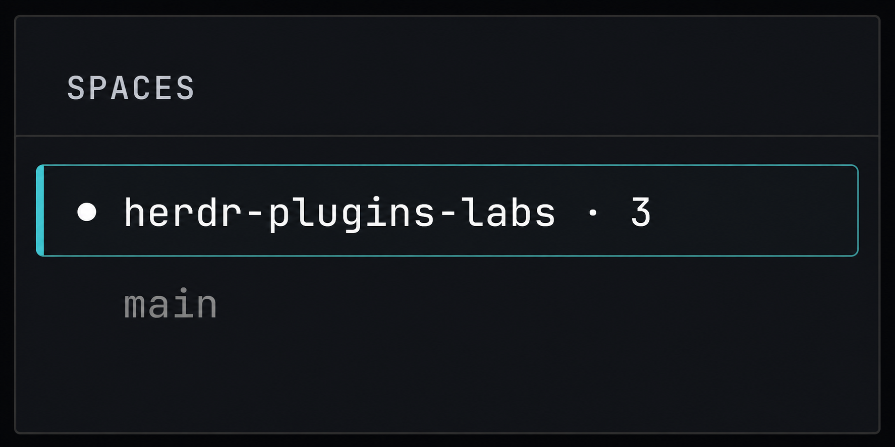
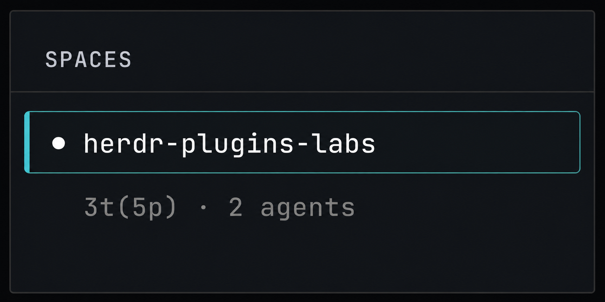

# herdr-plugins-labs

Experimental plugins for [Herdr](https://herdr.dev/).

## Plugins

### [Space Tab Count](./space-tab-count)

Exposes each workspace's tab count as the `$tab_count` Space sidebar token.

### [Space Stats](./space-stats)

Exposes tab, pane, and detected-agent counts as the `$space_stats` Space sidebar
token.

