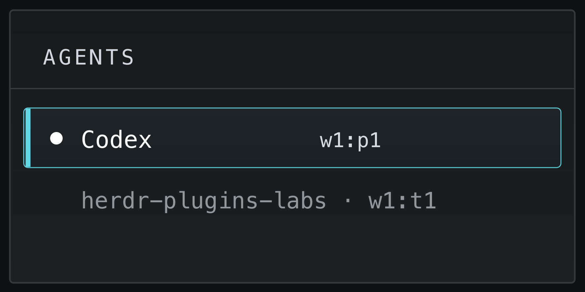

# Agent Pane ID

Expose each agent's Herdr pane and tab IDs as the `$pane_id` and `$tab_id`
custom tokens for Agent sidebar rows.



## Requirements

- Herdr 0.9.1 or newer
- Node.js 18 or newer

## Link for local development

From this directory:

```sh
herdr plugin link "$PWD"
herdr plugin action invoke dev.minung.agent-pane-id.sync
```

The `sync` action initializes every running agent. After that, the plugin
reports IDs whenever Herdr detects an agent in a pane.

## Configure the sidebar

Add `$pane_id` or `$tab_id` to the Agent rows in your Herdr configuration:

```toml
[ui.sidebar.agents]
rows = [
  ["state_icon", "agent", "$pane_id"],
  ["workspace", "$tab_id"],
]
```

IDs are not refreshed when a pane moves to another tab or workspace; run the
`sync` action again after moving an agent pane.
