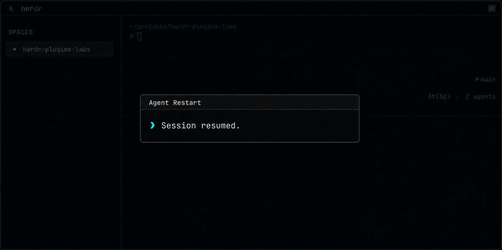

# Agent Restart

Agent Restart는 action을 실행한 pane의 idle Codex, Claude, Grok, Agy agent를 안전하게 재시작하고, Herdr가 보고한 동일 session ID를 이어서 실행합니다.



## 설치

로컬 checkout을 연결합니다.

```sh
herdr plugin link ./agent-restart
```

plugin은 Herdr 설정을 수정하지 않습니다. 다음 action binding을 직접 추가할 수 있습니다.

```toml
[[keys.command]]
key = "prefix+shift+r"
type = "plugin_action"
command = "dev.minung.agent-restart.restart"
description = "Restart Agent"
```

사용하는 agent(Codex, Claude Code, Grok, Agy)의 CLI가 `PATH`에 있어야 합니다. macOS와 Linux의 Herdr 0.7.4 이상을 지원합니다. 저장소 루트에서 `pnpm test`를 실행하면 모든 plugin을 테스트할 수 있습니다.

## 동작

agent가 실행 중인 pane에서 action을 호출합니다. popup은 launch origin pane에 지원 agent(`codex`, `claude`, `grok`, `agy`)가 있고 상태가 정확히 `idle`인지 확인한 뒤, session ID를 Herdr의 `agent_session`에서 읽거나, 이전에 resume된 Codex라면 실행 중인 `codex resume` 명령줄에서 읽습니다. `Esc`로 입력을 비운 다음 pane의 foreground 프로세스가 종료될 때까지 `Ctrl+C`를 반복해서 보내고(두 TUI 모두 두 번 눌러 종료), 5초가 지나면 포기합니다.

그다음 같은 launch origin pane에서 agent에 맞는 resume 명령(`codex resume <id>`, `claude --resume <id>`, `grok --resume <id>`, `agy --conversation=<id>`)을 실행하고 popup을 닫으며 focus를 돌려줍니다. resume된 agent는 pane에서 바로 보이므로 plugin은 추가 검증을 하지 않습니다.

검증이 실패하거나 agent가 종료되지 않으면 resume이나 복구 입력을 보내지 않습니다. 아무 키나 누를 때까지 popup에 원인을 표시합니다. active, blocked, unknown, 미지원, session ID가 없는 agent는 재시작하지 않으며 session ID 이외의 기존 CLI option은 복원하지 않습니다.

Herdr가 `agent_session`으로 session ID를 확정적으로 보고하는 agent만 지원합니다. OpenCode처럼 Herdr에도, 프로세스 명령줄에도 session ID를 노출하지 않는 agent는 지원하지 않습니다 — 추측으로 세션을 재개하면 이 plugin의 안전성 보장이 깨지기 때문입니다.
