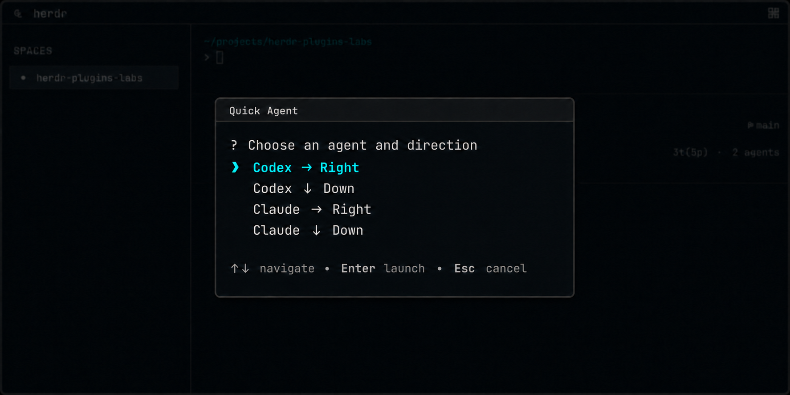

# Quick Agent

Quick Agent를 사용하면 키보드만으로 현재 작업 중인 pane 옆에 Codex 또는 Claude Code를 실행할 수 있습니다. 작은 popup에서 agent와 분할 방향을 고르면 새 pane이 바로 열립니다.



## 설치

로컬 checkout을 연결합니다.

```sh
herdr plugin link ./quick-agent
```

GitHub에 게시된 경우에는 `herdr plugin install <owner>/<repo>/quick-agent`를 사용합니다.
plugin은 Herdr 설정을 자동으로 수정하지 않습니다. 다음 action binding을 직접 추가할 수 있습니다.

```toml
[[keys.command]]
key = "prefix+a"
type = "plugin_action"
command = "dev.minung.quick-agent.open"
description = "Open Quick Agent"
```

저장소 루트에서 `pnpm install`로 고정된 workspace 의존성을 설치하고 `pnpm test`로 전체 plugin 테스트를 실행할 수 있습니다. 선택한 시점에 Codex와 Claude Code가 `PATH`에 있어야 하며, Herdr 0.7.4 이상, macOS와 Linux를 지원합니다.

## 사용법

설정한 단축키(예: `prefix+a`)를 누르면 44×10 popup이 열립니다. Codex와 Claude Code 중 하나를 고르고, 새 pane을 오른쪽 또는 아래 중 어디에 열지 선택합니다. 처음에는 `Codex → Right`가 선택되며, Up/Down과 Enter로 실행하고 Esc 또는 Ctrl+C로 취소할 수 있습니다.

선택한 agent는 Quick Agent를 연 pane과 같은 작업 디렉터리에서 50:50 크기의 새 pane으로 실행되고, 새 pane으로 focus가 이동합니다. 실행 중이라는 상태가 잠깐 표시된 뒤 성공하면 popup이 닫힙니다.

Quick Agent가 열린 뒤 launch origin pane이 사라져도 다른 pane으로 바꾸지 않고 오류를 표시합니다. split 후 agent 명령이 실패하면 생성된 pane은 확인과 재사용을 위해 자동으로 닫지 않습니다.
